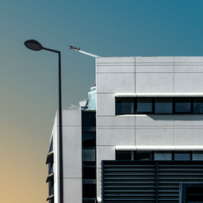

# HiColor



HiColor is a program for converting images to 15- and 16-bit RGB color, the color depth of old display modes known as ["high color"](https://en.wikipedia.org/wiki/High_color).  In 15-bit mode images have 5 bits for each of red, green, and blue, and the last bit is reserved.  In 16-bit mode green, the color the human eye is generally most sensitive to, gets 6 bits.

I wrote this program because I wanted to create images with the characteristic high-color look, and nothing seemed to support high color.  It implements its own simple [file format](format.md) and converts between this format and PNG.  To reduce the quantization error (the difference between the original and the high-color pixel), it uses the period-appropriate [Bayer ordered dithering](https://bisqwit.iki.fi/story/howto/dither/jy/#StandardOrderedDitheringAlgorithm) algorithm.  Dithering can be disabled with a command line flag.  HiColor files have the extension `.hic` or `.hi5` for 15-bit and `.hi6` for 16-bit.

The program is written in C with minimal dependencies and builds as a static binary by default.  It works at least on Linux and Windows 7.

## Known bugs and limitations

### PNG file size

PNG files HiColor produces are unoptimized.  Run them through [OptiPNG](http://optipng.sourceforge.net/).

### Generation loss

Right now repeated conversion to `.hic` and repeated quantization cause (capped) [generation loss](https://en.wikipedia.org/wiki/Generation_loss) when dithering is enabled (by default).  There is no such generation loss without the dithering.  I am not sure whether to fix this or to keep it for artistic use.  The effect looks pretty cool on color high-contrast anime-style images, making them resemble [PC-98](https://en.wikipedia.org/wiki/PC-9800_series) art.  The example below illustrates a best-case scenario.  It converged (stopped changing) after 100 generations.  Most anime images won't look this good.


(Cropped from a [piece](https://www.pixiv.net/en/artworks/50218294) by Suparu.  I believe this is fair use, but I'll remove this picture if you own it and ask.)

.

Photos suffer more than artwork.  They work best when they are high-contrast with a lot of neon.

## Usage

HiColor has a Git-style CLI.

The actions `encode` and `decode` convert images between PNG and HiColor's own image format.  `quantize` round-trips an image through the converter and outputs a normal PNG.  Use it to create images that look high-color but aren't.  `info` displays information about a HiColor file: version (`5` for 15-bit or `6` for 16), width, and height.

```none
HiColor
Create 15/16-bit color images.

usage:
  hicolor (encode|decode|quantize) [options] src [dest]
  hicolor info file
  hicolor version
  hicolor help

options:
  -5, --15-bit     15-bit color
  -6, --16-bit     16-bit color
  -n, --no-dither  Do not dither the image
```

## Building

### Debian/Ubuntu

```sh
sudo apt install -y build-essential tclsh
make test
```

### Cross-compiling for Windows

The following commands build a 32-bit executable for Windows.

```sh
sudo apt install -y build-essential gcc-mingw-w64-i686
make hicolor.exe
# Wine is needed only for testing.
sudo apt install -y tclsh wine
make test 'HICOLOR_COMMAND=wine ../hicolor.exe'
```

## License

MIT.

[cute\_png](https://github.com/RandyGaul/cute_headers/) is copyright (c) 2019 Randy Gaul and is licensed under the zlib license.

### Photos from Unsplash

[Building photo from Bordeaux](https://unsplash.com/photos/AwtncJT1qKs) (`building-15bit.png`) by olaf wisser.

[NYC photo](https://unsplash.com/photos/bucV25NA6gI) (`nyc-15bit-gen-100.png`) by Phi Tran.

[Portland photo](https://unsplash.com/photos/PWBXQJ7PUkI) (`tests/photo.png`) by Orlova Maria.
